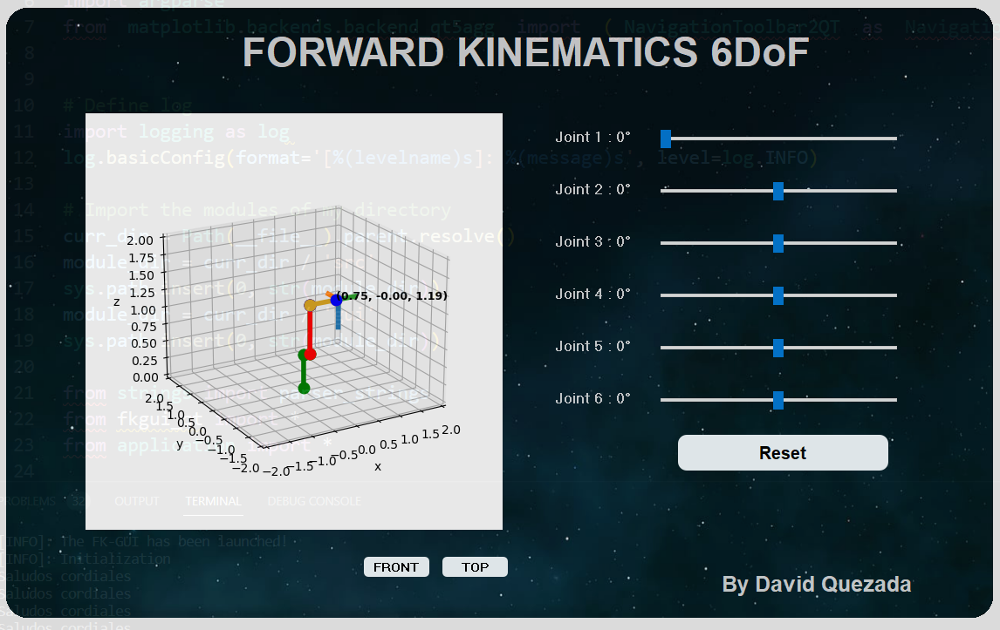

# Forward-Kinematics-6DoF-GUI
GUI to show the control of a 6DoF manipulator using The Denavit-Hartenberg(DH) convention to solve the forward kinematics of the robot.

 >Details  
 - The user is able to move the joins of a 6DoF robot manipulator and see in realtime the plot of the structure of the robot and the position of the end-effector. Aditionally, it has a button of reset values and it is possible to change between views.

### Modules
 - sys : [www](https://docs.python.org/3.9/library/sys.html)
 - argparse: [www](https://docs.python.org/3.9/library/argparse.html)
 - Logging: [www](https://docs.python.org/3/howto/logging.html)
 - NumPy : [www](https://numpy.org/doc/stable/)
 - Matplotlib: [www](https://matplotlib.org/stable/index.html)
 - Pyqt5: [www](https://pypi.org/project/pyqt5-tools/)

## GUI
The graphical User interface was designed with the tool QT Designer and Pyqt5.
 - Qt Designer: [www](https://doc.qt.io/qt-6/qtdesigner-manual.html)

## Screenshot
[]
